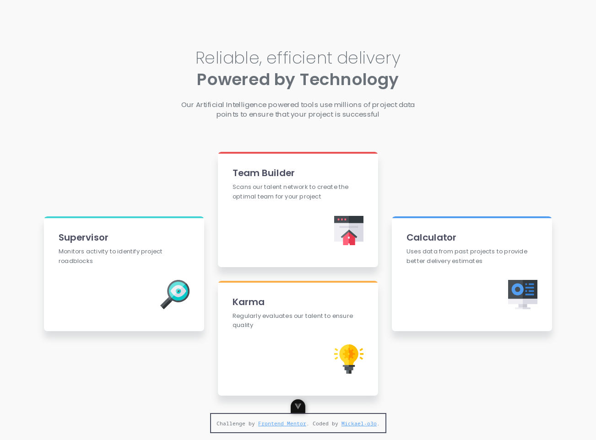

# Frontend Mentor - Four card feature section solution

This is a solution to the [Four card feature section challenge on Frontend Mentor](https://www.frontendmentor.io/challenges/four-card-feature-section-weK1eFYK). Frontend Mentor challenges help you improve your coding skills by building realistic projects.

## Table of contents

- [Overview](#overview)
  - [The challenge](#the-challenge)
  - [Screenshot](#screenshot)
  - [Links](#links)
- [My process](#my-process)
  - [Built with](#built-with)
  - [What I learned](#what-i-learned)
- [Author](#author)

## Overview

### The challenge

Users should be able to:

- View the optimal layout for the site depending on their device's screen size

### Screenshot

### Links

- Solution URL: [https://github.com/mickael-o3o/Four-card-feature-section-solution.git](https://github.com/mickael-o3o/Four-card-feature-section-solution.git)
- Live Site URL: [https://mickael-o3o.github.io/Four-card-feature-section-solution/](https://mickael-o3o.github.io/Four-card-feature-section-solution/)

## My process

### Built with

- [Vue](https://vuejs.org)
- [Sass](https://sass-lang.com)
- Mobile-first workflow
- CSS custom properties
- Flexbox
- CSS Grid
- Mobile-first workflow

### What I learned

Using grid to easily implement complexe page layout.

## Author

- Frontend Mentor - [@mickael-o3o](https://www.frontendmentor.io/profile/mickael-o3o)
